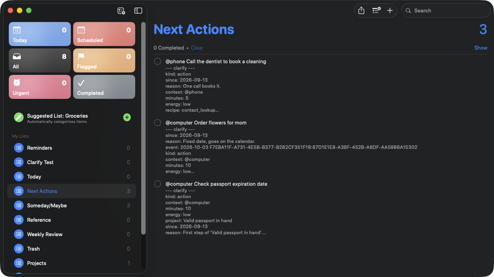
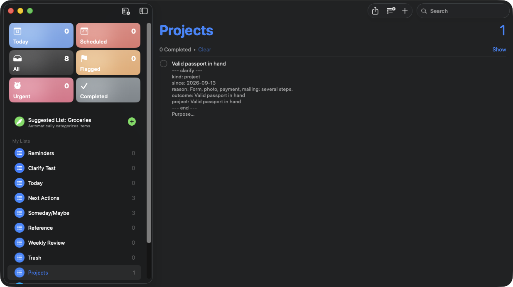
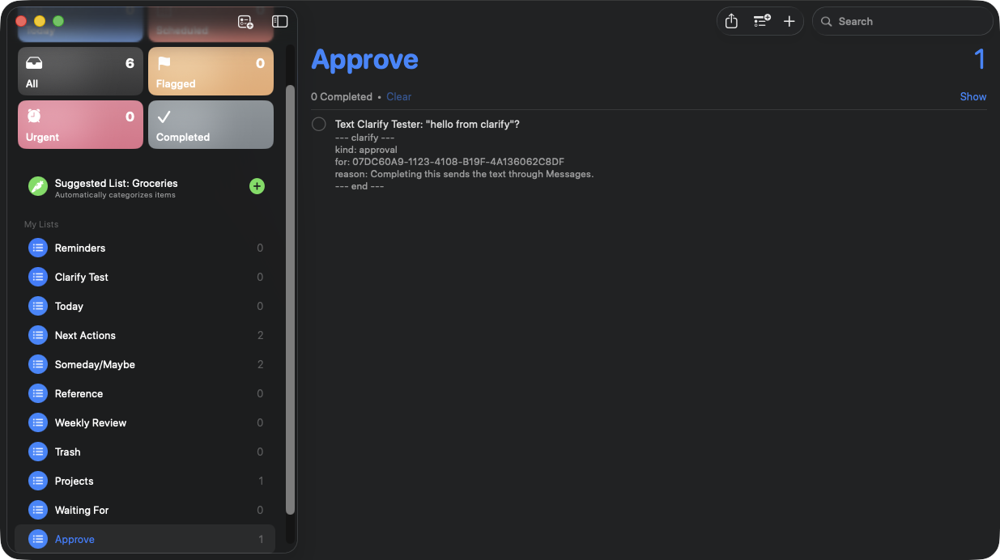
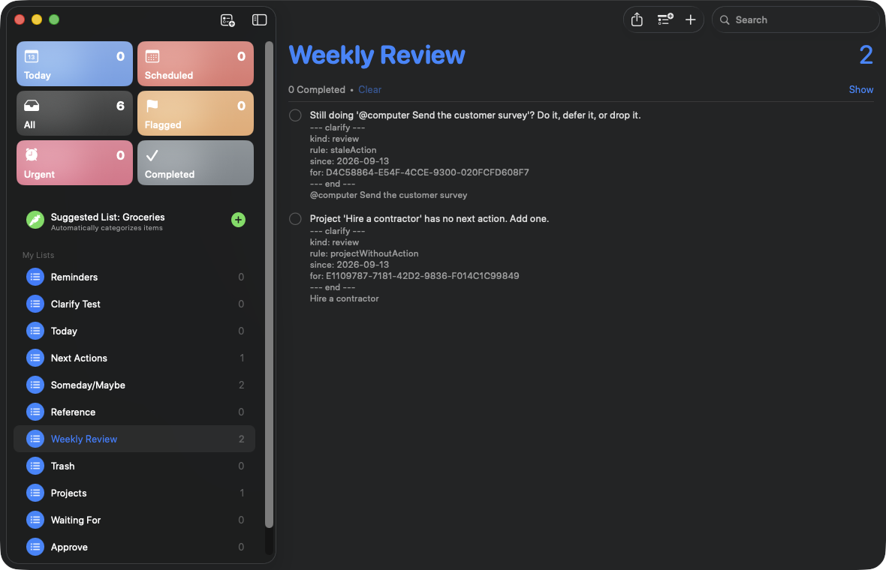
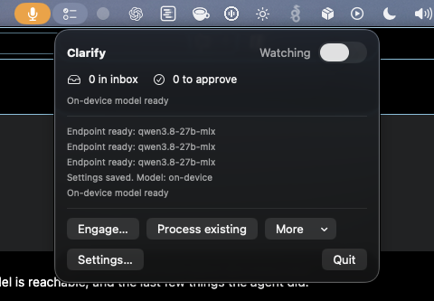
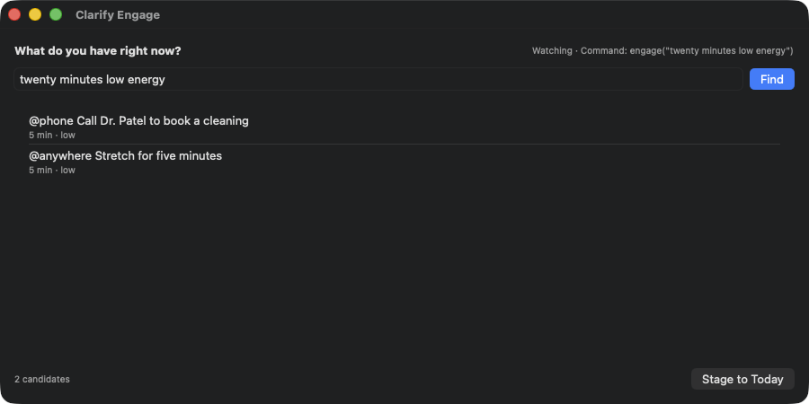
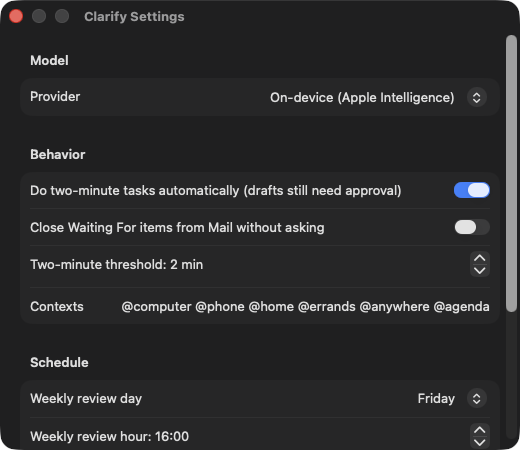

# Clarify

An agent that runs Getting Things Done inside Apple Reminders.

Capture anywhere Apple lets you capture: Siri on your watch, a line typed on
the Mac, a shared link. Clarify is a menu bar app that processes every new
item in your default Reminders list the way David Allen says to. It decides
whether the item is actionable, writes the next physical action, files it into
the right list, puts dated items on your calendar, drafts the two-minute ones,
watches Mail for the things you are waiting on, and runs the weekly review.
Every decision is written into the reminder's notes with a one-line reason.

Nothing leaves the Mac without your consent, and consent is a reminder. Drafts
and texts land in an **Approve** list. Checking one sends it, from any device.

Model calls run on-device with Apple Intelligence, or against any
OpenAI-compatible endpoint you point it at in Settings. No cloud account is
required.



## Powered by OpenRouter and Exa

Clarify's agent is only as capable as the model that drives it and the world
it can see. Two services provide both.

**[OpenRouter](https://openrouter.ai)** is the brain. The agentic tool loop
needs native tool calling, and OpenRouter routes Clarify to a tool-calling
model of your choice with one key and one endpoint. The default is
`anthropic/claude-sonnet-5`; switch models in Settings without changing a
line of code. Every request carries OpenRouter's app attribution, so Clarify
shows up by name on your OpenRouter dashboard. On a live run, "text Dana that
I'm running late" chained a Contacts lookup into a drafted text in about
seven seconds end to end.

**[Exa](https://exa.ai)** is the eyes. The agent's `web_search` tool calls
Exa's answer endpoint, which returns a grounded answer with citations instead
of a page of links. That is what lets "call the Apple Store to check MacBook
stock" end with the store's phone number saved onto the reminder: the agent
asked Exa, got `(617) 385-9400` with its sources, and wrote it down for you.

Both are optional. Without an OpenRouter key, clarification runs on-device and
two-minute tasks use a simpler deterministic path. Without an Exa key, the
`web_search` tool is simply not offered to the agent.

| | OpenRouter | Exa |
|---|---|---|
| Role | Runs the tool-calling loop | Answers the agent's web questions |
| Where it is used | `EndpointLanguageModel`, `ToolLoop` | `ExaClient`, the `web_search` tool |
| Set up | Settings > Provider > OpenRouter, paste key | Settings > Web search, paste key |
| Proven live | Contact lookup → drafted text, unsent | Web lookup → phone number saved to reminder |

## Try it in two minutes

1. Build and launch (below). Allow Reminders and Calendar when asked.
2. Say to Siri on your phone: "Remind me to book the dentist."
3. Watch the Mac. Within a few seconds the item leaves your Reminders list
   and appears in Next Actions as `@phone Call the dentist to book a
   cleaning`, with the reason in its notes.
4. Say: "Remind me to text Sam I'm running late." An item appears in the
   Approve list. Check it. Messages sends the text.

## How it works

1. **You capture.** A reminder lands in your default list, from Siri, the
   watch, the phone, or the Mac.
2. **The Mac notices.** Apple's EventKit tells Clarify the list changed.
   There is no polling and no server; the app sits in the menu bar.
3. **The model decides.** Clarify sends the item's text, today's date, and
   your list of areas to the model with one question: what is this, and what
   is the very next physical action? The answer comes back as a fixed form,
   never free text: kind, next action, context, minutes, energy, date, person.
4. **Swift does the moving.** Deterministic code files the reminder in the
   right list, rewrites its title with the next action, writes the reasoning
   into its notes, and creates a calendar event if there is a date. The model
   never touches Reminders directly and never calls a tool.
5. **Anything outgoing waits for you.** If the action is small enough, Clarify
   prepares it, a Mail draft with the file attached or a text, and puts a
   question in the Approve list. Checking that reminder is the send button.
   Nothing leaves the Mac otherwise.

```
phone or watch ──▶ Reminders (iCloud) ──▶ Mac: EventKit change
                                                │
                                                ▼
                                    one model call, typed answer
                                                │
                                                ▼
                         Swift files, retitles, annotates, calendars
                                                │
                                   outgoing? ───┴──▶ Approve list ──▶ you check it ──▶ sent
```

The weekly review, the tickler, and the morning briefing run on timers inside
the same app. The review is pure code: it reads the lists, finds what is stale
or missing, and writes one line per finding.

## The agent loop

For the two-minute tasks, Clarify runs a bounded tool-calling loop. The model
chains tools across apps until the task is prepared, it needs you, or it hits a
six-step cap:

- **Read tools**, which run directly: look up a contact, find a file, check the
  calendar, search your reminders, read recent mail.
- **Prepare tools**, which never send: draft an email or text, create an event.
  Every send waits in the Approve list.
- **web_search**, backed by [Exa](https://exa.ai), for facts it does not have
  locally: a business's phone number, an address, an official link. It returns a
  short answer with sources.
- **save_note**, to leave a fact it found on the reminder, so a research task
  ("call the Apple Store to check stock") ends with the number on the reminder,
  ready to tap.
- **ask_user**, when it genuinely cannot proceed. It files the question as a
  reminder and stops; you answer in the notes, and completing it resumes the
  loop with your answer.

So "text Sam I'm running late" becomes: look up Sam in Contacts, draft the text
to the number that came back, queue it in Approve. "Email Sam the deck" becomes:
look up Sam, find the deck with Spotlight, draft the mail with it attached,
queue it. "Call the Apple Store to check stock" becomes: search the web for the
store's number and save it onto the reminder. Each step is shown in the menu bar
log.

The loop needs a model with tool calling, so it runs on an endpoint provider.
Clarify ships with **OpenRouter** as a first-class option: pick a model such as
`anthropic/claude-sonnet-5`, paste your key, and the agent chains through it.
On-device Apple Intelligence still handles clarification and does the
two-minute tasks with a simpler deterministic path.

## What it does with each item

| GTD step | What Clarify does |
|---|---|
| Inbox | Watches your default Reminders list, whatever it is named. Siri already writes there. Items that were in the list before first launch are left alone until you choose **Process existing**. |
| Clarify | One model call per item decides the kind: trash, reference, someday, calendar, waiting, action, or project. |
| Next Actions | Files the item under `Next Actions` with a context prefix, minutes, and energy: `@phone Call Dr. Patel to book a cleaning`. |
| Projects | Anything needing more than one step goes to `Projects` with a natural-planning note: purpose, principles, outcome, brainstorm, three next actions. The first action is created for you. |
| Calendar | Date and time items become real Calendar events. |
| Waiting For | Delegated items go to `Waiting For`. Each Mail check looks for a reply from that person and asks, in Approve, whether to close it. |
| Two-minute rule | Short actions run a recipe: a Mail draft with the right attachment, a text, a calendar event, a contact or file lookup. Sends wait in Approve. |
| Someday/Maybe, Reference, Trash | Lists of those names. Nothing is ever deleted. |
| Tickler | A reminder with a start date surfaces into the inbox on that day. |
| Weekly review | On the day and hour you set, a checklist in `Weekly Review`: stale actions, projects with no next action, overdue Waiting Fors, old Someday items, goals with no project. The findings and their wording are deterministic; no model call. |
| Engage | Menu bar: "twenty minutes, low energy" returns the actions that fit, using the four-criteria model. |
| Morning briefing | A notification after the daily sweep with today's events and the top three next actions. |

Metadata lives in a small block at the top of each reminder's notes. Your own
text below it is never touched.



Anything outgoing waits in the Approve list. Checking the reminder, on any
device, is the send button.



The weekly review writes a checklist of what the lists reveal: stale actions,
projects with no next action, overdue Waiting Fors, old Someday items.



The menu bar popover shows what is in the inbox, what is waiting for approval,
whether the model is reachable, and the last few things the agent did.



Engage takes "twenty minutes, low energy" and returns the actions that fit,
ordered by due date and age.



## Installing a release

Download the DMG from the [Releases](https://github.com/bradegan/clarify/releases)
page, open it, and drag Clarify to Applications. Release builds are produced by
a GitHub Actions workflow without a signing certificate, so on first launch
macOS will say it cannot verify the developer: right-click the app, choose
Open, and confirm once. After that it launches normally.

To cut a release, push a version tag:

```sh
git tag v0.1.0 && git push origin v0.1.0
```

## Building and running

Requirements: macOS 26, Xcode 26, [XcodeGen](https://github.com/yonaskolb/XcodeGen).

```sh
xcodegen generate
xcodebuild -project Clarify.xcodeproj -scheme Clarify -configuration Debug -derivedDataPath build/DerivedData build
open build/DerivedData/Build/Products/Debug/Clarify.app
```

Builds are ad hoc signed by default, which is enough to run locally. To sign
with your own Developer ID, create a gitignored `Signing.local.xcconfig` next
to `project.yml`; `Signing.xcconfig` includes it when present:

```
DEVELOPMENT_TEAM = YOURTEAMID
CODE_SIGN_IDENTITY = Developer ID Application
ENABLE_HARDENED_RUNTIME = YES
OTHER_CODE_SIGN_FLAGS = --timestamp
```

For an installed copy, build the Release configuration and copy it to
`~/Applications`:

```sh
xcodebuild -project Clarify.xcodeproj -scheme Clarify -configuration Release -derivedDataPath build/DerivedData build
ditto build/DerivedData/Build/Products/Release/Clarify.app ~/Applications/Clarify.app
open ~/Applications/Clarify.app
```

### Permissions

On first launch macOS asks for Reminders and Calendar access. Reminders is
required. Calendar is optional; without it the app still runs and dated items
wait in the inbox. Contacts and Automation for Mail and Messages are requested
the first time a recipe needs them.

Two details learned the hard way:

- Debug builds use the bundle id `com.eganai.clarify.debug`. macOS keys
  privacy grants on bundle id plus signature, and mixing a development-signed
  build and a Developer ID build under one id leaves the installed app silently
  denied.
- The Release build uses the hardened runtime, so `App/Clarify.entitlements`
  declares Calendar, Contacts, and Apple Events. Without those entries macOS
  denies Calendar without ever showing a dialog.

### Settings



Open Settings from the menu bar icon. Choose the on-device model or an
endpoint, and for an endpoint enter the base URL and model name. The API key,
if any, goes in your keychain. You can also set the context vocabulary, the
two-minute threshold, whether Waiting For items close without asking, and the
review schedule.

The endpoint client sends a strict JSON schema and reads the answer from
`content` or, when a thinking model leaves that empty, from
`reasoning_content`.

### Commands

The app answers a `clarify://` URL scheme, so Shortcuts and scripts can drive
it: `clarify://process`, `clarify://process/existing`,
`clarify://review/weekly`, `clarify://sweep/daily`, `clarify://mail/check`, and
`clarify://engage?q=twenty%20minutes`.

### Logs

Every action is appended to
`~/Library/Application Support/Clarify/clarify.log`, rotated at one megabyte.
The ledger of processed items is `ledger.json` beside it. If a change
notification is ever missed, a once-a-minute fallback pass catches the item
and says so in the log.

## Measured

Sixty inbox items across every GTD kind and context, in a local gold set kept out of the repo:

| Provider | Kind | Context | Verb-first action | Median latency |
|---|---|---|---|---|
| Apple Intelligence on-device | 68% | 57% | 87% | 2.4 s |
| OpenRouter, anthropic/claude-sonnet-5 | 97% | 92% | 96% | 3.5 s |

Kind is the GTD bucket the item was filed in. Context is the `@context` on
actions. Verb-first checks that the next action starts with a physical verb
from the accepted list. Any OpenAI-compatible endpoint, such as LM Studio,
works the same way; run the command below against it to get its numbers.

Reproduce with your own gold set, a JSONL file of `{"title", "kind", "context", "verbs"}` items:

```sh
cd Packages/ClarifyKit && swift build -c release --product clarify-eval
.build/release/clarify-eval --gold path/to/inbox.jsonl --provider on-device
.build/release/clarify-eval --gold path/to/inbox.jsonl --provider endpoint \
  --url https://openrouter.ai/api --model anthropic/claude-sonnet-5 --key "$OPENROUTER_API_KEY"
```

## Tests

```sh
cd Packages/ClarifyKit && swift test
```

runs the unit suite in memory. Real-wiring tests skip unless enabled:

```sh
CLARIFY_EVENTKIT_TESTS=1 CLARIFY_FM_TESTS=1 CLARIFY_MAIL_TESTS=1 \
CLARIFY_ENDPOINT_URL=http://127.0.0.1:1234 CLARIFY_ENDPOINT_MODEL=qwen3.8-27b-mlx swift test
```

The EventKit test uses a list named `Clarify Test`. The Mail test creates and
deletes a draft addressed to `user@example.com`. The `Eval/` directory is
ignored, so gold sets, fixtures, and reports never enter the repo. The UI test drives the real
Engage window with an in-memory store and a keyword model:

```sh
xcodebuild -project Clarify.xcodeproj -scheme Clarify -derivedDataPath build/DerivedData test
```

## Design

`Packages/ClarifyKit` holds everything that is not UI. Each job is one typed
model call, guided generation on-device or a strict JSON schema on the
endpoint, followed by deterministic Swift that moves reminders, writes headers,
and creates events. The model never calls a tool and never sends anything.

## Credits

- [OpenRouter](https://openrouter.ai) routes the agentic tool loop to a tool-calling model of your choice.
- [Exa](https://exa.ai) powers the agent's `web_search` tool with grounded answers and citations.
